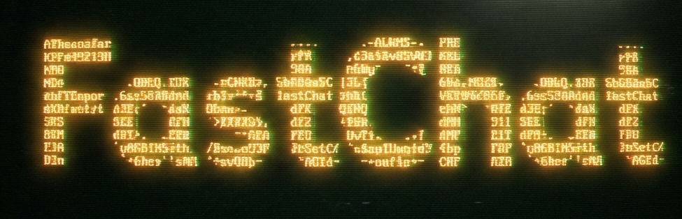
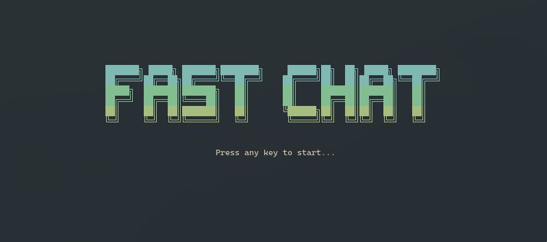
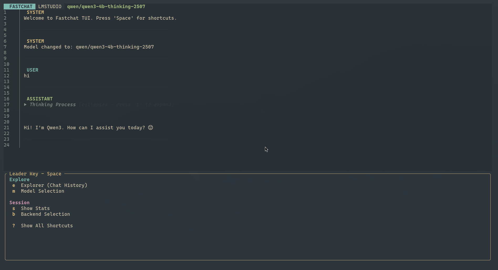

**FastChat** is a blazing fast, open-source local LLM chat stack. It combines a lightweight, keyboard-driven Terminal User Interface (TUI) written in Rust with a powerful, high-performance Python backend powered by TabbyAPI.

---

## 🚀 Features

### 🖥️ FastChat TUI (The Frontend)
Built with **Rust**, **Ratatui**, and **Tokio**, the frontend is designed for speed and efficiency.
- **Vim-like Keybindings**: Navigate and interact without leaving the keyboard.
- **Chat History**: Local history management to save and resume conversations.
- **Multiple Backends**: Dynamically switch between different API endpoints.
- **Streaming Support**: Real-time token streaming for a responsive experience.
- **Resource Efficient**: extremely low memory footprint compared to Electron-based apps.





---

## 🛠️ Installation

### Prerequisites
- **Rust** (for the TUI): [Install Rust](https://www.rust-lang.org/tools/install)
- **Python 3.10+** (for the Backend)
- **NVIDIA GPU** (Recommended for TabbyAPI/ExLlama)

### 1. Set up the Backend (LM Studio)
I recommend installing LM studio or Ollama for backend gives you a great selection of models without a lot of headache.


### 2. Build the Frontend (FastChat TUI)

```bash
cd fastchat-tui

# Build the release binary
cargo build --release
```

---

## 🎮 Usage

### Step 1: Start the Backend
Launch the API server to start serving your models.

```bash
cd tabbyAPI
./start.sh  # or start.bat on Windows
```
*Ensure the API is running (default: http://localhost:5000).*

### Step 2: Launch the TUI
Open a new terminal window and start the client.

```bash
cd fastchat-tui
./target/release/fastchat-tui
```

### ⌨️ Keybindings
| Key | Action |
| :--- | :--- |
| `i` | **Input Mode** (Type your message) |
| `Esc` | **Normal Mode** / Exit menus |
| `Enter` | Send message (Input Mode) |
| `Space` | Open **Leader Menu** |
| `j` / `k` | Scroll chat or navigate history |
| `n` | New chat |
| `?` | Show shortcuts help |
| `q` | Quit application |

---

## 🤝 Contributing

We welcome contributions! FastChat is an open-source project and we'd love your help to make it better.

1. **Fork** the repository.
2. Create a **Feature Branch** (`git checkout -b feature/AmazingFeature`).
3. **Commit** your changes (`git commit -m 'Add some AmazingFeature'`).
4. **Push** to the branch (`git push origin feature/AmazingFeature`).
5. Open a **Pull Request**.

## 📜 License

This project is open-sourced software. Please refer to the `LICENSE` files in the respective subdirectories (`fastchat-tui` and `tabbyAPI`) for specific licensing details.

---

<p align="center">
  Made with ❤️ for the Open Source AI Community
</p>